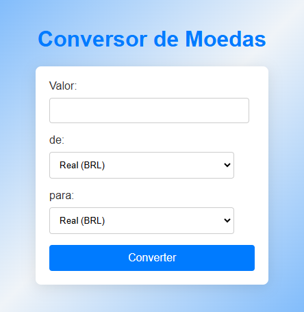

### 📝 Explicação do README:

1. **Título e Descrição**: Resumo claro do que é o projeto.
2. **Demonstração**: Uma secção para adicionar uma imagem ou captura de ecrã da interface.
3. **Funcionalidades**: Lista rápida do que o projeto faz.
4. **Tecnologias Utilizadas**: Para destacar o stack usado.
5. **Estrutura do Projeto**: Ajuda quem consulta a perceber a organização.
6. **Instruções para Execução Local**: Passo a passo simples para abrir o projeto.
7. **Melhorias Futuras**: Sugestões para expansões.
8. **Secção de Problemas**: Um incentivo para abrir issues.
9. **Licença**: Para indicar se é livre de uso ou tem alguma restrição.
10. **Autor**: Link para o teu perfil GitHub e outras redes sociais.
# Conversor de Moedas 💰

---

Este é um projeto simples de conversor de moedas desenvolvido em **HTML**, **CSS** e **JavaScript**. Ele permite converter valores entre três moedas: **Real (BRL)**, **Dólar (USD)** e **Euro (EUR)** com taxas de câmbio fixas.

---

### 📦 Como usar este README?

1. Guarda o conteúdo acima num ficheiro chamado `README.md` no teu repositório.
2. Se tiveres uma imagem da interface, adiciona-a na pasta do projeto e ajusta o caminho em ``.
3. Personaliza os links com o teu nome e os teus perfis no GitHub/LinkedIn.

Se tiveres mais alguma dúvida ou quiseres personalizar ainda mais o README, avisa! 😊

---

## 🚀 Demonstração

### Interface do Conversor:

 <!-- Se quiseres, adiciona uma captura de ecrã aqui -->

---

## 📋 Funcionalidades

- Converter valores entre **Real (BRL)**, **Dólar (USD)** e **Euro (EUR)**.
- Validação do valor inserido para evitar erros.
- Exibição do resultado diretamente na página.

---

## 🛠️ Tecnologias Utilizadas

- **HTML5**: Para a estrutura da interface.
- **CSS3**: Para o estilo da aplicação.
- **JavaScript**: Para a lógica de conversão e manipulação do DOM.

---

## 📂 Estrutura do Projeto

```bash
.
├── index.html         # Página principal
├── styles.css         # Estilos CSS
├── controller.js      # Lógica JavaScript
├── README.md          # Este ficheiro de documentação
└── screenshot.png     # Captura de ecrã (opcional)

👤 Autor
 cristian